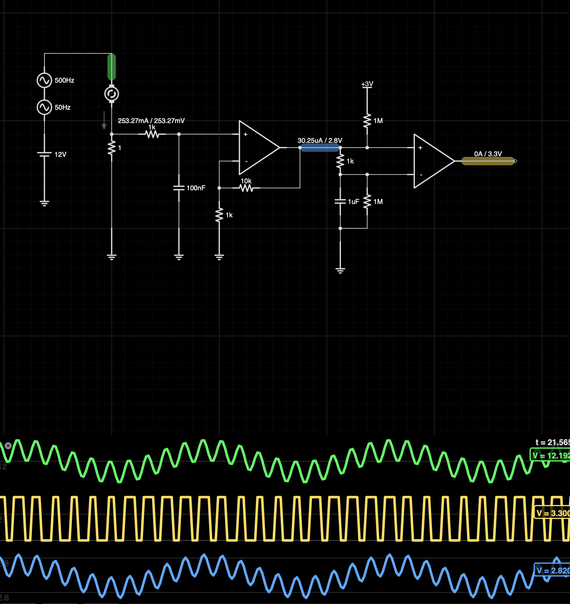

# robo-plater

A robot to manage plating PCBs

# Circuit Design

## Motor Driver

The feedback for the motor driver is fun. We use the fact that DC brushed motors means there's a convenient current ripple from the mechanical commutation. If we count the pulses in the current ripple, we can determine the position of the motor.

You can make a very simple circuit to do this using a single op-amp, and some discretes, but I've used a second op-amp here because even the cheapest packages seem to come with at least two op-amps.

